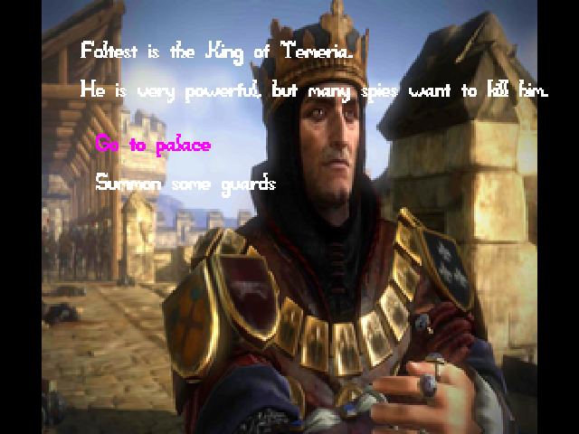

# The King's death

Author: Xuyang Fang

Design: It's a a dialog game. You will act as a king and try to survive in your palace. 

Screen Shot:

How To Play:

Make your own choice to survive !

Art Sources:

All the resources are free to use in non-commercial case.

Most art resource comes from the famous game, whitcher and whitcher 3.

Foltest:
https://www.gizorama.com/2015/feature/pretty-much-everything-you-need-to-know-about-the-witcher

https://www.youtube.com/watch?v=ekb5l4Iozcw

https://www.youtube.com/watch?v=UWiA062r_Lg

wine: 
http://pngimg.com/download/9490

shadow:
https://www.pinterest.com/pin/405464772686347089/

bedroom:
https://www.classicalinterior.com/listing/royal-gold-bedroom-set-carved-with-king-size-bed/

This game was built with [NEST](NEST.md).
